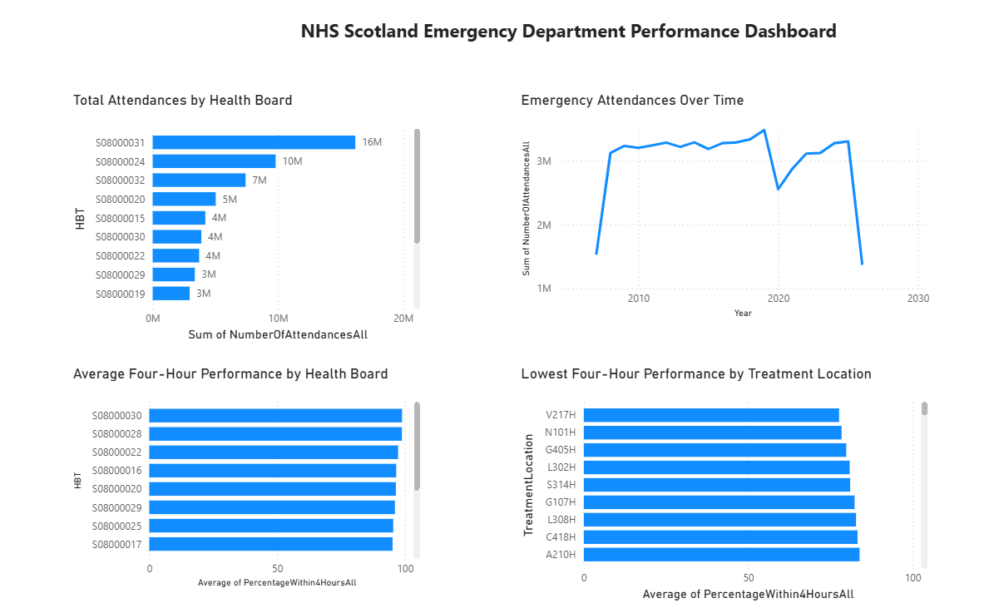

# NHS Scotland Emergency Department Performance Analysis

## Project Overview

This project analyses emergency department activity across NHS Scotland Health Boards using SQL and Power BI.

The aim of the project is to explore emergency department activity, assess performance against the four-hour standard, compare Health Boards and treatment locations, and present the findings through an interactive Power BI dashboard.

## Business Questions

- How many emergency department attendances were recorded?
- Which Health Boards had the highest attendance volumes?
- How does emergency department activity change over time?
- How does four-hour performance vary across Health Boards?
- Which treatment locations recorded the highest attendance volumes?
- Which treatment locations had the lowest four-hour performance?
- How does activity differ between department types?
- Are there duplicate records or other data-quality issues?

## Tools & Technologies

- SQL Server
- Power BI
- Microsoft Excel
- GitHub

## SQL Analysis

SQL was used to explore, clean, validate and analyse the dataset.

The analysis included:

- Data exploration
- Identifying unique Health Boards
- Checking attendance categories
- Checking department types
- Checking the available time period
- Counting total records
- Creating a cleaned dataset
- Validating the cleaned dataset
- Checking for duplicate records
- Analysing attendances by Health Board
- Analysing attendances by month and year
- Analysing attendances by department type
- Analysing attendances by treatment location
- Analysing four-hour performance

All SQL queries are available in the [SQL folder](./SQL).

## Power BI Dashboard

The cleaned data was used to develop an interactive Power BI dashboard for analysing emergency department performance.

The dashboard focuses on:

- Emergency department activity
- Attendance trends
- Health Board comparison
- Department type comparison
- Treatment location analysis
- Four-hour performance

The Power BI dashboard file is available in this repository.

## Project Structure

```text
NHS-Scotland-ED-Analysis/
│
├── Data/
├── Images/
├── SQL/
├── NHS_Scotland_Emergency_Department_Performance_Dashboard.pbix
└── README.md
```

## Dashboard Preview


